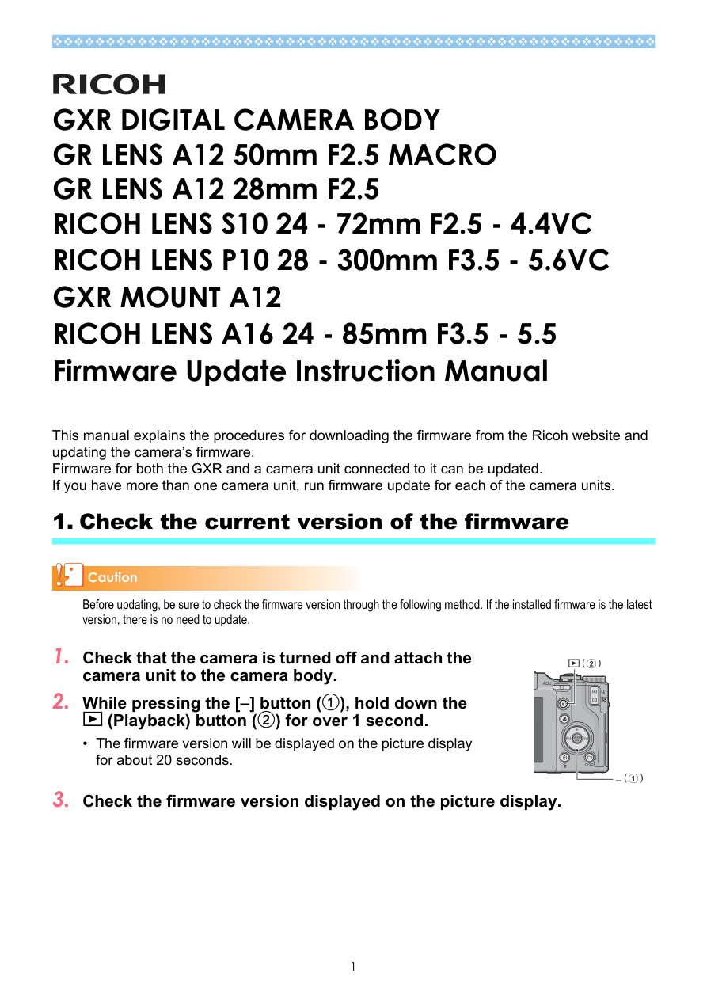
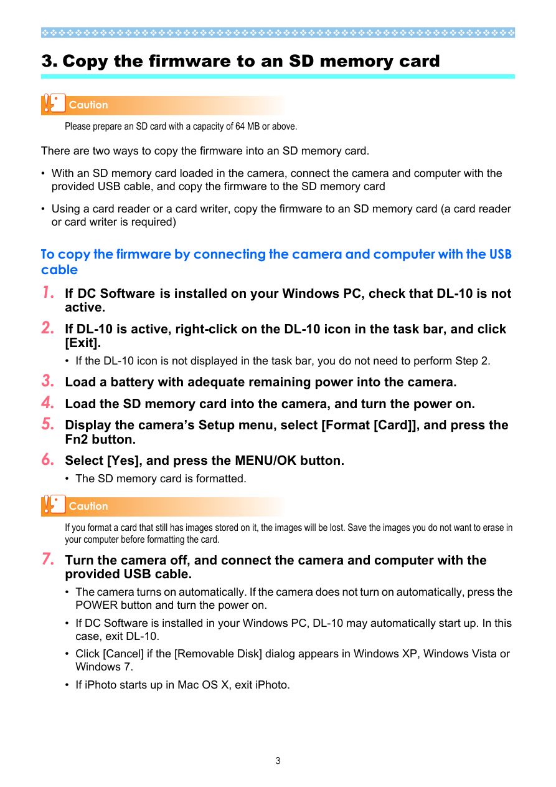
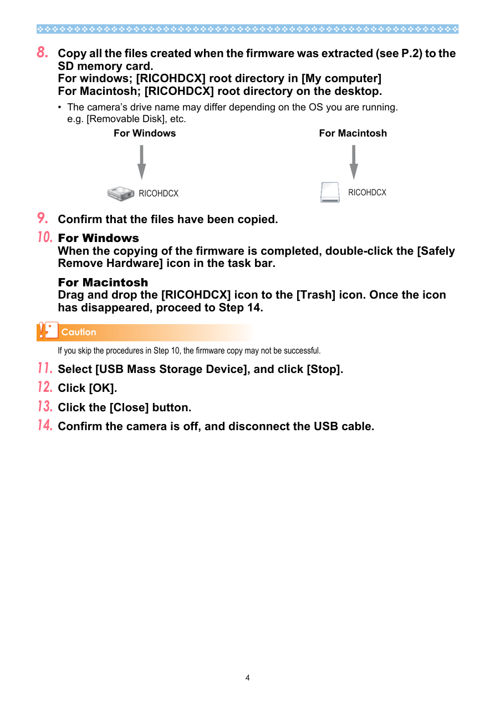
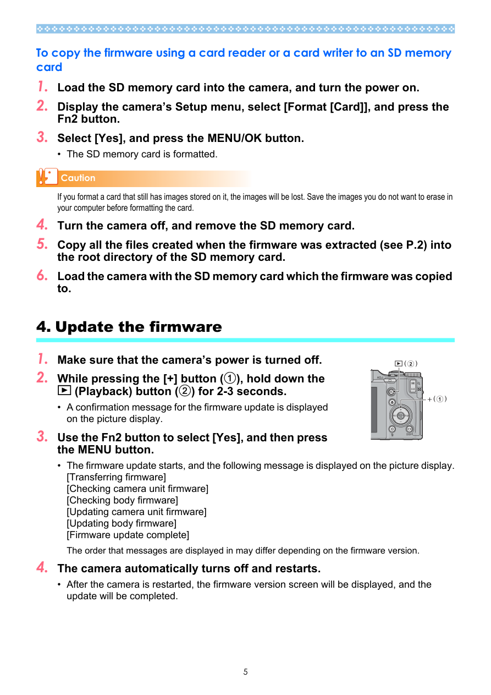

# Ricoh GXR 1.51 水水固件

本项目仓库及唯一发布地址：

<https://github.com/minakam1/ricoh-gxr-chinese-language-patch>

请只从上述仓库或其 GitHub Releases 下载，并核对随包提供的 SHA-256。其他网站、
网盘、网店或收费渠道中的副本可能不是本项目发布的原始文件。

“水水固件”提供两种 Ricoh GXR 1.51 语言修改方案，均已获得真机成功反馈：

| 发布版本 | 效果 | 是否持久 | 推荐用途 |
|---|---|---|---|
| **英文替换版** | 语言菜单仍显示 `日本語 / English`，选择 `English` 后显示简体中文 | 依赖修改固件 | 只需要简体中文，步骤较少 |
| **完全解锁版** | 语言菜单开放全部 11 种语言 | 写入地区配置，恢复官方固件后仍保留 | 真正解除日版语言限制 |

两个包都包含完整的 GXR 1.51 升级文件，可以把较旧版本的 GXR 机身及当前连接
的相机模块更新到 1.51；机身已经是 1.51 时，也可以再次执行更新来安装语言修改。

> 本项目是非官方固件研究成果。刷写前请完整阅读使用说明和免责声明。

## 下载

两个版本的 Release 页面：

- [水水固件 · 英文替换版 Release](https://github.com/minakam1/ricoh-gxr-chinese-language-patch/releases/tag/shuishui-english-v1.0)
- [水水固件 · 完全解锁版 Release](https://github.com/minakam1/ricoh-gxr-chinese-language-patch/releases/tag/shuishui-full-unlock-v1.0)

仓库内也直接保存固件及校验文件：

- [Ricoh_GXR_1.51_水水固件_英文替换版.zip](Ricoh_GXR_1.51_水水固件_英文替换版.zip)
- [英文替换版 SHA-256](Ricoh_GXR_1.51_水水固件_英文替换版.zip.sha256)
- [Ricoh_GXR_1.51_水水固件_完全解锁版.zip](Ricoh_GXR_1.51_水水固件_完全解锁版.zip)
- [完全解锁版 SHA-256](Ricoh_GXR_1.51_水水固件_完全解锁版.zip.sha256)

Release 页面使用上述中文完整名称作为附件标签。GitHub 会自动清洗附件实际文件名中
的中文字符，因此下载后也可能显示为以下兼容名称：

- `Ricoh_GXR_1.51_Shuishui_Firmware_English_Replacement.zip`
- `Ricoh_GXR_1.51_Shuishui_Firmware_Full_Unlock.zip`

每个 ZIP 内都包含独立的中文 `README.md` 和可直接复制到 SD 卡的 `SD_ROOT`。

仓库同时保存理光官方原版更新手册：

- [GXR 官方固件更新手册（英文）](官方固件更新手册/GXR官方固件更新手册_英文.pdf)
- [GXR 官方固件更新手册（日文）](官方固件更新手册/GXR官方固件更新手册_日文.pdf)
- [官方手册来源说明](官方固件更新手册/来源说明.md)

可公开复核的分析程序、实验构建脚本、阶段报告和结构化结果见：
[水水固件研究资料](研究资料/README.md)。研究目录不包含机身镜像、照片、序列号、
个人配置备份或官方固件原包。

## 版本选择

### 英文替换版

适合只想获得简体中文界面的用户：

- 日本语入口保持正常；
- `English` 入口改为简体中文；
- 不修改任何语言资源文件；
- 修改固件保留期间有效；
- 刷回官方 1.51 后，`English` 恢复为英文。

详细步骤见：[英文替换版使用说明](使用说明/英文替换版.md)。

### 完全解锁版

适合需要完整语言菜单的用户：

- 开放日本语、英语、德语、法语、意大利语、西班牙语、简体中文、韩语、
  繁体中文、俄语和泰语；
- 一次性写入机身地区配置；
- 写入成功后立即恢复官方 1.51；
- 恢复官方固件后，全部 11 种语言仍然保留。

详细步骤见：[完全解锁版使用说明](使用说明/完全解锁版.md)。

完全解锁版比官方升级包多一个 `BADJROM.DAT`：

```text
官方 1.51：29 个升级文件
英文替换版：29 个升级文件
完全解锁版：30 个升级文件
```

第 30 个文件是写入地区配置所需的调整数据载荷，并非官方升级文件，也不是重复
或误打包文件。使用完全解锁版时必须与其余 29 个文件一起复制。

## 固件更新方法

以下是理光官方《GXR Firmware Update Instruction Manual》的关键页面。原始英文、
日文 PDF 也保存在仓库中。

简要流程：

1. 电池充满，装好相机模块，在相机内格式化不小于 64 MB 的 SD 卡。
2. 把所选 ZIP 的 `SD_ROOT` 内全部文件复制到 SD 卡根目录。
3. 关机，按住 `+`，同时按住回放按钮 2–3 秒。
4. 用 Fn2 选择“是”，按 MENU/OK，等待更新完成并自动重启。
5. 英文替换版选择 `English`；完全解锁版继续按包内说明完成一次性写入和官方
   固件恢复。

本项目固件可以把旧版本更新到 1.51，不要求机身预先安装 1.51。拥有多个相机
模块时，需要分别连接每个模块执行更新。

### 官方手册：检查版本



### 官方手册：准备 SD 卡



### 官方手册：复制固件



### 官方手册：执行更新



## 技术原理

### 固件原本已经包含 11 种语言

GXR 1.51 的机身程序、语言资源和字体中已经包含全部 11 种语言。日版机身只显示
日本语和 English，不是缺少中文资源，而是机身地区配置限制了语言菜单。

固件内部的主要语言编号为：

```text
0  日本语
1  English
2  Deutsch
3  Français
4  Italiano
5  Español
6  简体中文
7  한국어
8  繁体中文
9  Русский
10 ไทย
```

### 英文替换版

英文替换版只修改机身程序 `ilaunch3`。共同语言初始化入口收到 English 的编号
`1` 时，将有效编号改为简体中文的 `6`，再继续调用原厂资源、字体和界面初始化
流程。日本语编号 `0` 不变，所有 `launch4/firm4` 语言资源保持官方原版。

### 完全解锁版

机身调整区 `BADJ` 的偏移 `0x17` 是语言地区门控：

```text
0     只建立日本语和 English 两项
非 0  建立全部 11 项
6     开放全部语言，并以简体中文作为地区默认值
```

完全解锁版将该字段从 `0` 改为 `6`，更新调整数据校验，并在用户确认语言时通过
原厂 `BADJROM` 导入、验证和持久化路径写入机身。地区值保存在机身调整区，所以
随后恢复官方 1.51，全部语言仍会保留。

### 固件校验

修改后的 `ilaunch3` 保持官方文件长度和 1.51 版本字段，并重新计算固件使用的
六相加权校验：

```python
checksum = sum(
    byte * ((index % 6) + 2)
    for index, byte in enumerate(payload)
) & 0xffffffff
```

## 免责声明

1. 本项目仅供学习研究，如有侵权请联系作者删除。**禁止任何形式的商业分发或商业利用**，
   包括但不限于销售文件、付费下载、收费刷机、收费解锁、作为商业维修服务的一部分、
   与相机或存储卡捆绑销售、建立
   商业下载镜像，或通过本项目直接或间接获利。
2. 本项目由爱好者基于停止官方技术支持的设备进行研究，与 Ricoh、Pentax、
   Ricoh Imaging 或其关联公司无关，也未获得上述公司的授权、认可或保证。
3. 本项目不是官方维修工具。修改固件、写入调整区和恢复固件均有可能导致无法
   开机、设置丢失、校准参数异常、照片丢失或其他不可预见的损害。
4. 固件已经获得特定真机的成功反馈，但不保证所有机身批次、销售地区、相机模块、
   SD 卡、电池状态或既有配置都能得到相同结果。
5. 使用者必须自行核对机型、文件、校验值和操作步骤，并自行承担刷写、使用和
   恢复过程中的全部风险与后果。
6. 项目作者和贡献者不对任何直接、间接、偶发、特殊或后续损失承担责任，包括但
   不限于设备损坏、数据丢失、维修费用、停机或无法恢复。
7. 更新前应备份照片、保留官方原始 1.51 固件，并在可能的情况下备份机身调整
   数据。更新过程中必须使用电量充足的电池，不得断电、拔卡或拆卸相机模块。
8. 仓库中的理光官方更新手册仅为方便核对原厂操作流程而保存，相关商标、文字、
   图片和文档版权归各自权利人所有。

下载、复制、刷写或使用本项目文件，即表示使用者已阅读并接受以上风险说明。

## 支持作者

如果你喜欢这个项目，可以自愿请作者喝杯咖啡。
